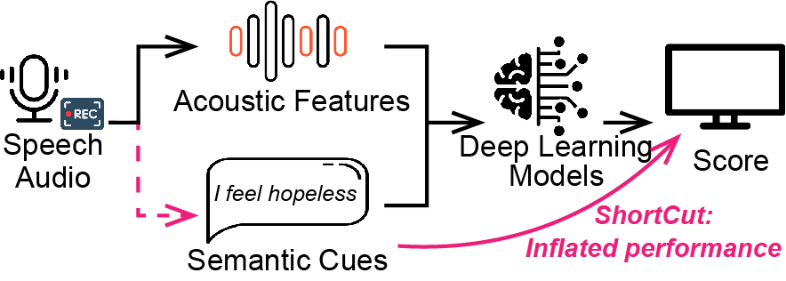

# Semantic Leakage in Speech-based Depression Prediction

> **Live website:** [https://njnklab.github.io/Semantic-Leakage/](https://njnklab.github.io/Semantic-Leakage/)

A cue-aware audit and mitigation framework for checking whether speech-based depression prediction models rely on explicit symptom language embedded in interview audio.

## Figure

[](https://njnklab.github.io/Semantic-Leakage/)

## Repository

- `src/` and `public/`: paper website and static assets
- `code/`: Cue-Aware Agent, CueFilter, experiments, and analysis scripts

## Citation

```bibtex
@misc{xu2026semantic,
  title = {Semantic Leakage in Speech-based Depression Prediction},
  author = {Xu, Xiao and Zhang, Xizhe},
  year = {2026},
  note = {Preprint submitted to IEEE Transactions on Affective Computing}
}
```
